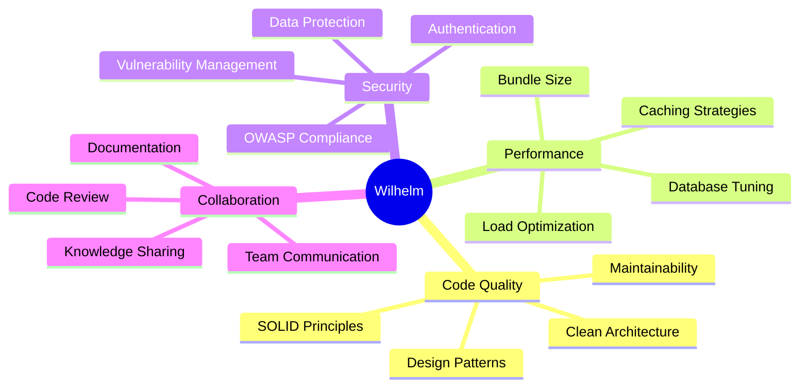

# 👋 Hey, I'm Nathan Hallouin

<div align="center">

### 🚀 Senior Fullstack Engineer
**React • Node.js • TypeScript • Cloud Architecture**

[](https://linkedin.com/in/nathan-hallouin)
[](https://nathanhallouin.dev)
[](mailto:nathan.hallouin@ikmail.com)

> 💡 Building scalable, production-grade applications with modern JavaScript ecosystems and cloud-native architectures.

</div>

---

## 🎯 What I Do

```typescript
const wilhelmRosental = {
  role: "Senior Fullstack Engineer",
  focus: ["Web Applications", "Cloud Architecture", "Performance Optimization"],
  currentlyLearning: ["Rust", "WebAssembly", "Distributed Systems"],
  funFact: "I debug code faster with coffee ☕"
};
```

---

## 🛠️ Technical Arsenal

### 💻 Frontend Development


**React Ecosystem** • Hooks • Context API • Redux • Server Components
**Angular** • RxJS • Reactive Programming • Component Architecture
**Core Tech** • TypeScript • JavaScript (ES6+) • HTML5 • CSS3
**Styling** • SCSS • Tailwind CSS • CSS-in-JS • Responsive Design
**Testing** • Jest • React Testing Library • Vitest • Playwright • E2E Automation

### 🔧 Backend Engineering


**Node.js** • Express • Fastify • RESTful APIs • GraphQL • Microservices
**Java Stack** • Spring Boot • Spring Security • JPA/Hibernate • Maven
**Databases** • PostgreSQL • MySQL • MongoDB • Redis • Query Optimization
**Authentication** • OAuth2 • JWT • Session Management • Security Best Practices

### ☁️ DevOps & Infrastructure


**Containerization** • Docker • Kubernetes • Container Orchestration
**CI/CD** • GitHub Actions • Jenkins • Automated Testing Pipelines
**Cloud Platforms** • AWS (EC2, S3, RDS, Lambda) • Infrastructure as Code
**Development Workflow** • Git • Agile/Scrum • Code Review • Documentation

---

## 📊 GitHub Stats

<div align="center">


</div>

---

## 🎯 Engineering Principles



---

## 💼 Professional Focus

<table>
<tr>
<td width="50%">

### 🏗️ Architecture
Designing scalable, maintainable system architectures for long-term growth and team productivity.

</td>
<td width="50%">

### ⚡ Performance
Optimizing application speed, reducing resource usage, and improving overall user experience.

</td>
</tr>
<tr>
<td width="50%">

### 🎨 Developer Experience
Building tools and workflows that enhance team productivity and code quality.

</td>
<td width="50%">

### 🛡️ Production Quality
Delivering reliable, well-tested code with comprehensive monitoring and error handling.

</td>
</tr>
</table>

---

## 📈 Activity Graph

[](https://github.com/ashutosh00710/github-readme-activity-graph)

---

<div align="center">

### 💬 Let's Connect!

**Open to collaborating on interesting projects and discussing tech!**

[](https://linkedin.com/in/yourprofile)
[](https://twitter.com/yourhandle)
[](https://yourportfolio.com)


</div>
